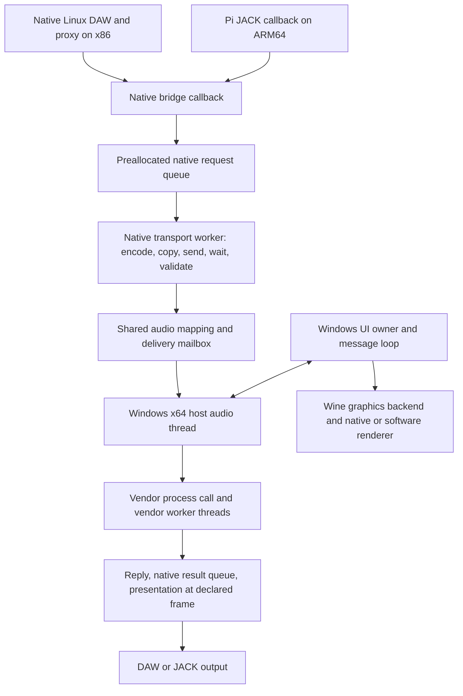

# ARM execution and bridge portability reassessment

2026-09-25. Engineering assessment and proposed correction; no new compatibility
claim, accepted architecture amendment, runtime installation or performance fix.

## Judgment

The Pi experiments establish that unmodified Windows x64 plug-ins can execute,
produce audio, expose controls and sometimes recall state through our bridge on
ARM. They do not establish a dependable musical instrument. The failures justify
reworking the execution boundary, integration and qualification method. They do
not establish that all bridge code is wrong, every synthesizer crashes, or the Pi
can deliver any desired plug-in workload after an architectural rewrite.

The main structural problems established here are:

1. The Pi is a substantially divergent experimental fork, not the current native
   DAW product with a small hardware/runtime adapter.
2. The deadline-bearing processing chain still contains allocation, repeated
   copies/validation, serialized transport and polling. Protecting the native
   callback alone does not make delivery of the next sound block predictable.
3. Ordinary queue capacity bounds storage, but permits seconds of obsolete work.
   The newer recovery experiment limits that damage; it does not remove the
   processing cost that caused lateness.
4. Graphics, runtime, environment migration and supervisor limits have each
   produced independent failures. A window disappearing cannot identify which
   one failed.
5. Buffer values, CPU denominators and evidence levels have been mixed in the
   interpretation of results. That makes the next intervention unreliable.

The recommended correction is one portable bridge core with explicit execution
adapters and a bounded musical timeline. Runtime or hardware changes must preserve
that contract. Real ARM-only execution on x86 is also an operator requirement;
it is a separate direction of translation, not a feature supplied by FEX.

## Exact basis and limits

The starting workspace was the historical SR0 checkout `7eee151`; it was not
used as the current implementation. Remote refs were refreshed for this review.

| Basis | Commit | Tree |
| --- | --- | --- |
| Canonical main | `b76c9e2270c63c78be2a51adf6562a3f838ffa7f` | `74e13f5b1e10bd4a53d8b626657c403320fb62d2` |
| Pi recovery/re-arm source | `67f9d518a63d7bb19405bdd5fe5ceae1320e6a30` | `c7032f6bd8287a5e29dc1cd9f38e64fdf725e1a5` |
| Pi physical loopback branch | `e8c11b293122f176969c453b0b531751034bd7d5` | `3a54a03b3dc8691c0566f8ee91eb62879f4ada1d` |
| Rejected FEX scalar candidate | `42afc24f495e047722c365e29810ddc13a192bba` | `b30424fcc2aadadb133e7f0a3476d82a77d34995` |

Main and the inspected Pi head share ancestor
`a86f03e8a5d5302d9872f995a0a5ba376a0ab6d5`, with 155 main-only and 124 Pi-only
commits. Counts establish divergence, not defect counts. For example, current
main has multi-output/stereo negotiation and controller/editor corrections that
cannot be assumed present in the Pi candidate.

Authority used: operator's reassessment instruction; AGENTS real-time, identity,
privacy and fixture laws; current GOVERNANCE “Decisions” and “What evidence
means”; ARCHITECTURE §§5.2, 5.7–5.9, 6.3–6.6, 7, 13 and 15; WORKSTREAMS “One
product, separate execution lanes.” Main's current task remains WD0. This report
does not replace that lane's task or import unmerged Pi implementation into it.

This review inspected source and retained records. It did not access the live Pi,
Deck or Ubuntu installation, replace services, reproduce audio, or certify their
current installed identities. Main is the current source basis, not an assertion
that main's entire artifact set is installed. The retained [Deck UI0 record][deck]
identifies its manager generation and exact publication/host pairs; its manager
acceptance is not a fresh audio-performance result. Ubuntu live parity remains a
gap in this assessment.

The current [support matrix][support] bounds the x86 comparison: Deck AP17 uses
48 kHz, host maximum at most 512 and 512 added bridge frames. Ubuntu's accepted
FRAGMENTS result includes editor/audio/recall and a cold boot, with recorded
underruns and explicit Bitwig 512/48-kHz configuration. Setting PipeWire's quantum
alone had not changed Bitwig's 1,024-frame internal maximum. Neither a complete
mixed-six Deck project nor the other five products on Ubuntu is qualified by
that matrix. These limitations should travel with the code being reused.

## What actually executes

This is a logical map of two frontends, not a claim that the divergent branches
already share an identical implementation. On x86 Linux, Windows code uses Wine
without an x86-to-ARM translator. In the recorded RPI2 topology, the Linux
launcher, pressure-vessel and Wine Unix infrastructure are native AArch64; FEX
ARM64EC runs the retained x64 Windows host and plug-in code. RPI0/RPI1 instead
used Box64 with an x86 runtime. The [RPI2 topology record][rpi2] establishes the
change through mapped modules and executable architectures.

For each Pi callback, [JACK integration][jack] reads audio/MIDI, constructs process
context, submits bounded chunks and consumes results for the presentation frame.
Missing results produce counted silence. It then measures output and updates
counters. The transport worker consumes requests sequentially, writes audio to
the mapping, encodes events/context, waits for the Windows reply, validates it
and publishes a completion. The [Windows audio thread][windows-audio] calls the
vendor processor; plug-in-created workers may participate. Editor and lifecycle
work retain their Windows owner thread. These threads share CPU, memory and
potential vendor locks even though they have different responsibilities.

## Findings by layer

| Layer | Established source or retained observation | Required correction or unresolved question |
| --- | --- | --- |
| Product/core ownership | Pi frontend links `ap2-backend`, but carries a long fork plus RPI0/RPI1/RPI2 scripts and private staged combinations. | Reconcile useful changes onto current canonical interfaces. Keep JACK, panel and machine adapters outside shared processing semantics. Do not merge the fork wholesale or revive old process rules. |
| Distribution/sandbox integration | Ubuntu's native and Windows endpoints originally used separate loopback namespaces; the accepted repair shares a private loopback while retaining other isolation. | Make mounts, runtime directories, IPC reachability and graphical ownership explicit adapter responsibilities. A shared path/port number does not prove connectivity. Preserve the narrow repair rather than enabling host networking. [FC-PLAT-001][platform] |
| CPU instruction translation | Native ARM Wine/FEX is already present. The matched light-reference comparison did not establish a general total-CPU or deadline improvement over Box64. | Treat translator, Wine and host build as a compatible pinned combination. Compare actual expensive workloads; fewer translated layers is a design advantage, not a measured speedup. |
| CPU architecture and memory ordering | FEX must preserve x86 behavior on different ARM hardware. Pi 5 has four Cortex-A76 cores. | Inspect supported instructions, atomics, memory ordering and translation costs per SoC. “ARM64” alone is insufficient selection data. No relaxed correctness switch as a general performance fix. |
| Kernel/scheduler | Historical 4 KiB/16 KiB runtime failures and later kernel changes exist. Short Pigments windows showed little runnable wait, substantial caller execution and worker kernel time. | Page-size/ABI support, wakeup tails, IRQ placement and Wine synchronization are separate questions. No evidence yet that a new distro, RT kernel or affinity setting fixes the dominant workload. |
| Memory and supervision | The inspected appliance supervisor imposes `MemoryMax=3G`, `TasksMax=512` and ordinarily a finite runtime. A recorded Serum editor session expired at 300 seconds. | Whole-machine free RAM cannot rule out a cgroup kill. Attribute exits using the owned unit, memory events and lifecycle record. Development time limits are not an ordinary instrument lifetime policy. |
| Native callback | Bounded queues, sample-position correlation, silence on missing output and pre-touched queue storage are useful implemented boundaries. | Preserve them. Bound maximum work, including completion draining and instrumentation, against the actual callback budget. A comment or atomic type is not a timing proof. |
| End-to-end processing path | Rust builds a fresh request vector, event payload and decoded mailbox buffer per call. Windows constructs/resizes reply vectors on its audio thread. Multiple buffer copies and guard scans occur. | Replace recurring owned allocation with reusable bounded storage. Account for necessary validation and each copy; remove redundant work without dropping identity, bounds or malformed-result checks. Exact performance benefit is unmeasured. |
| IPC/synchronization | Native mailbox has one in-flight request; native waits poll with 50 microsecond sleeps and a much longer liveness timeout. Separate GUI/control handling exists. | Measure service/wakeup tails and preserve reentrancy. A five-second liveness bound is not an audio deadline. Compare notification mechanisms only on a matched complete path; additional in-flight calls cannot simply parallelize one stateful VST instance. |
| Timeline/backlog | Ordinary request capacity is 2,048 blocks. At 256 frames/48 kHz that represents 10.92 seconds of audio work. Retained queue wait reached seconds. Expired output is discarded after processing. | Bound admitted work by musical lateness, not storage capacity. Reconcile notes and controls when discontinuing a timeline; blindly skipping DSP/input blocks changes stateful behavior. |
| Recovery/lifecycle | BR1 stops admission, suppresses old-epoch results and can STOP/START the same instance. The Serum record ends in a later exhausted-recovery fault. | Keep containment distinct from restored usability. Determine the initiating stall and correct lifecycle semantics; increasing recovery count does not improve processing capacity. |
| Graphics/editor | Serum's retained DXVK path failed device creation; V3DV lacked a required feature. WineD3D with software OpenGL reached visible UI. | Rendering support and acceptable CPU cost need separate results. Software rendering consumes CPU capacity; it is a plausible contributor, not an established cause of the Serum stall. A changed renderer must not alter DSP identity/state. |
| Audio device/backend | JACK period, processing quantum, presentation reserve, vendor latency and ALSA buffering differ. Physical loopback exists separately. | Publish one timing account with measurement endpoints. JACK, PipeWire or direct ALSA is a backend choice, not an automatic latency reduction. Keep audio clock, resampling and drift explicit. |
| Installation/state/authorization | RPI2 migration recorded an Arturia machine-key mismatch; later authorized activation resolved that particular state refusal. Some fresh-process state recalls passed. | Environment migration is not prefix copying. Preserve vendor-permitted machine identity and content references; validate state per exact plug-in/class/build. Keep license state private and vendor controlled. |
| Diagnostics | Buffered recording reduced recorder CPU; later native phase OFF/ON/OFF still showed high Windows CPU and severe warm-up failures. | Reuse those results. They disable native phase tracing, not every observer. Account separately for callback counters, native worker observation, Windows instrumentation and filesystem drains. |

The allocation findings are directly visible in [native processing][native-process],
[mailbox decoding][mailbox] and [Windows result publication][mapped]. The deadline
chain includes those workers even where code labels them “non-RT.” This is a
structural issue, not evidence that those allocations caused the measured 38 ms
Serum call. Main also retains per-call native request allocation; this is not
solely a Pi adaptation defect.

There is also an explicit authority conflict in the unmerged recovery candidate:
[`Callback::process_live`][recovery-source] selects recovery versus terminal failure
using lateness, recovery-count and re-arm policy inside the audio callback. The
operator-supplied real-time law prohibits recovery policy decisions there.
Executing STOP/START on the worker does not resolve that ownership conflict.
Preserve bounded callback observation/admission/silence behavior, but assign
recovery decisions to the non-callback owner. This report surfaces the conflict;
it neither amends the law nor promotes that candidate as the new architecture.

## What the measurements actually say

### CPU, RAM and the failure signal

One fully busy core is 100% on the retained per-process scale. On four cores,
150% is 1.5 core-seconds per wall-second, or 37.5% of aggregate capacity.
Approximately 30% overall is therefore not inherently contradictory, although
different sample windows/scopes prevent an exact reconciliation of that pair.
A plug-in's own DSP meter may instead measure time against the audio deadline;
its denominator must be identified before comparing it with an OS meter.

The stronger retained example is native phase OFF/ON/OFF: Windows consumed
145.57/146.83/146.26% of one core and whole-Pi utilization was
38.92/37.73/37.46%. The calling thread used about 94% of one core and a second
processing thread about 44%. This was not a purely single-threaded workload.
Stable ON mean vendor/service time was 4.954/5.107 ms against 5.333 ms for a
256-frame block. Roughly 0.23 ms mean headroom is fragile; averages do not bound
attack, preset or scheduling tails. Warm-up failures persisted with phase tracing
off. [Retained comparison][rpi2]

Sampling attributed most measured user-cycle weight to translated Pigments
processor code. It does not separate useful synthesis from translation expansion
or synchronization inside that code. Worker kernel samples included `getrusage`,
`sched_yield` and futex paths. The attempted four-operation FEX scalar lowering
change produced identical captured instruction bodies and was correctly rejected.
There is no demonstrated FEX codegen speedup to integrate. [Rejected candidate][scalar]

No reviewed record establishes RAM exhaustion as the general cause. Likewise,
JACK xruns, missing bridge frames, queue overflow, lost MIDI, endpoint loss,
supervisor expiry, host exception and whole-device failure are distinct signals.
Calling all of them “dropped packets” or “crash” loses the causal boundary.

### The recent Serum failure

The [BR1 commercial record][serum-gate] used Serum 2.1.5, JACK 512, Windows
quantum 256 and bridge reserve 512 at 48 kHz. One recovery had already occurred
before the owner changed the preset. The later completed request took 39.854 ms
in full service, including 38.801 ms in the measured Windows processing span.
The configured lateness horizon was 1,024 frames, or 21.33 ms. The bridge entered
`recovery_exhausted`; the helper sent quit and eventually stopped the owned unit.
The editor disappeared and sound stopped. Normal retirement was not obtained.

This establishes a real unusable outcome and its containment chain. It does not
establish a vendor exception before teardown or explain the initiating delay.
The re-arm candidate proves its policy on a source-owned peer; its own scope
explicitly excludes commercial usability. Neither result repairs the preset
failure. Conversely, retained initial Serum sound/state observations and earlier
Pigments runs prevent a truthful claim that all instruments invariably crash on
the first note. [Serum onboarding][serum-onboarding]

### Latency has named endpoints

At 48 kHz, 128/256/512/2,048 frames are 2.67/5.33/10.67/42.67 ms.
These are durations, not interchangeable descriptions of total latency.

For the declared fixed-delay presentation scheme, the digital input-to-output
timeline delay is the bridge reserve plus the vendor's reported algorithmic
delay. Processing has to finish within the available schedule; its wall time is
not automatically another fixed latency term. The hardware/backend route adds
capture/playback and converter delay. A physical loop measurement already contains
its JACK/ALSA scheduling effects, so adding those buffers again double-counts.
MIDI-to-sound also has an arrival phase and no analog capture leg.

The isolated SHIELD XL physical output-to-input loop measured **552 frames /
11.50 ms** at JACK 128 with ALSA period 128/buffer 384. That is one short stereo
measurement, not a universal hardware floor. Digitalis separately reported 4,096
vendor frames; with a 128-frame reserve, the additive estimate is
`552 + 4096 + 128 = 4776` frames, **99.50 ms**, for that route. This agrees closely
with the operator's approximate pedal-minus-direct difference; it is not a new
full-chain measurement. [Loopback result][loopback]

Thus “9 ms” needs its original endpoints and fixture before it can be compared.
Reducing JACK while holding reserve/vendor delay constant cannot eliminate those
other delays. Increasing reserve can cover finite jitter; it cannot sustain a
processor that produces fewer than 48,000 frames per second over time.

## What current upstream work changes

### The operator's actual reference: Collabora Holo Core

The operator supplied [Collabora's Holo Core announcement][holo]. It describes an
Arch-derived AArch64 package port, reproducible dependency/build-order work and a
development container. The page is dated July 17, 2026. Its published snapshot
covers a subset of Arch; the build tooling was not yet published at announcement.
It also demonstrates ARM Linux userspace on x86 through QEMU and binfmt.
That directly informs both our build portability and the requested reverse
execution direction; it does not establish real-time audio performance.

The [download index][holo-packages] was independently read on September 25. Its
`mash-20251118` alias resolved to `mash-20251118.3`, with core/extra repositories,
debug repositories, sources, package-manager configuration and `system.rootfs.zst`.
The core and extra indexes contained 254 and 4,306 package archives respectively.
Selected filenames identify Linux 6.17.8, Mesa 25.2.7, Wine 10.19, JACK 1.9.22,
PipeWire 1.4.9 and QEMU user-static 10.1.2. These are index observations, not
inspected binary contents or a proven Pi boot image. No archive/container was
downloaded or executed. GitLab source browsing returned an access denial, so its
source tree was not reviewed. The public observations are retained in
[holo-preview-index.json](../evidence/arm-portability-reassessment/holo-preview-index.json).

**Our inference and proposed use:** adopt the discipline of coherent dependencies,
repeatable builds and matching architecture variants. Evaluate a digest-pinned
Holo build container as an additional build fixture after dependency/toolchain
inspection. Keep Debian/Pi hardware integration separate. A userspace container
shares its host kernel and cannot supply a missing Pi GPU driver, IRQ policy or
audio-driver fix. A root filesystem does not prove board boot/firmware support.

For a product appliance, derive an exact tested package/runtime set with provenance
and rollback. Do not feed the moving snapshot alias into ordinary updates or copy
preview package-authentication settings into the product: the inspected preview
configuration uses optional signatures. Holo packaging, Proton/Wine, FEX, kernel
support and the bridge remain distinct owners even when shipped together.
The reference therefore strengthens the case for rebuilding our integration
method; it provides no basis to replace the user's working Pi image immediately.

### FEX and lower-level runtime work

Separately, Valve's [Proton 11 beta1][proton-beta] already listed FEX for ARM64EC
on April 16, 2026. FEX-2609 was published September 8; its blog is dated September
7. The Holo announcement is not a newly finished FEX implementation.

[FEX-2609][fex-release] improves JIT behavior and adds optional disk caching.
Its authors also describe cache growth/invalidation limitations. It is a
candidate to evaluate as part of a matching runtime, not a proven cure for our
warm-up gaps. Our existing GE-Proton ARM64EC route already incorporates the
essential native-runtime/translated-Windows topology.

The more consequential comparison is FEX's [memory-ordering article][fex-memory].
It explains hardware-dependent costs of preserving x86 memory semantics and
unaligned atomics. It identifies a Steam Frame kernel patch that handles some
unaligned atomic emulation inside the kernel, avoiding repeated userspace signal
round-trips. The linked [kernel change][atomic-patch] is a concrete lower-level
integration to inspect. It is not evidence that our Pigments/Serum hot path is
dominated by those operations or that the Pi already has that support.

The next useful question is whether our workload actually incurs the relevant
faults/emulation and whether the Pi kernel supports that interface. Only a positive
answer makes a controlled kernel comparison worthwhile. Other candidates—Wine
yield behavior, scalar-SSE lowering and graphics fallback—require their own causal
evidence. Do not disable memory ordering or mix arbitrary FEX DLLs with a runner.

There is no route “below Linux” that removes Windows API, ISA, device-driver and
musical timing obligations. A tailored Linux image can select an appropriate
kernel, drivers and services. It cannot manufacture missing CPU/GPU capabilities.
Start with the existing Debian fixture and identify a specific limiting boundary;
selecting a different image should follow that finding. Pi results do not qualify
a Rockchip board, and a faster ARM board is not guaranteed to improve a single
translated processing chain. [Pi hardware description][pi-hardware]

There is relevant Rockchip-specific work to use when selecting that fixture:
Collabora's [mainline Rockchip overview][rockchip] reports Linux/U-Boot/Mesa
progress and RK3588 Vulkan 1.4 conformance. That motivates checking an exact
board/driver stack for the graphics features missing in the Pi experiment; it is
not evidence that our plug-ins, audio hardware or timing already work there.

## Proposed portable product boundary

Keep one canonical owner for plug-in/class identity, installation and authorization
posture, content references, host sessions, state and recovery reporting. Separate
the following replaceable parts by explicit contracts:

- **Host frontend:** native DAW proxy versus standalone audio/MIDI appliance.
- **Execution adapter:** host ISA, guest ISA, operating-system ABI, exact Windows
  or Linux host artifact, translator, Wine where needed, and runtime dependencies.
- **Device adapter:** JACK/PipeWire/ALSA and audio/MIDI device configuration.
- **Display adapter:** compositor/window route, Wine graphics path, driver and
  supported graphics features, with an explicit software-rendering posture.
- **Platform integration:** kernel requirements, page size, scheduling/resource
  policy, service ownership and packaging.

These are design responsibilities, not a proposal for five new daemons or freely
mixable user settings. Select a tested, pinned combination before activation;
changes use an explicit update and rollback. Incompatible combinations are refused
with a specific reason. The user chooses the product and makes music; internal
qualification absorbs the complexity.

| Execution direction | Candidate shape | Current claim ceiling |
| --- | --- | --- |
| Windows x64 on Linux x86-64, including a future CachyOS fixture | Native x86 proxy/host frontend and pinned x86 Wine runtime | Existing Deck/Ubuntu evidence remains fixture-specific; CachyOS requires distribution integration and physical validation. |
| Windows x64 on Linux ARM64 | Native ARM frontend/Wine infrastructure plus FEX ARM64EC | Demonstrated on Pi; instrument reliability and capacity incomplete. |
| Linux ARM64 binaries on Linux x86-64 | Separate ARM64 guest process with matching libraries and a candidate such as QEMU user translation | Research direction, not implemented or qualified for audio. A native x86 DAW cannot load an ARM ELF plug-in directly. |
| Windows ARM64/ARM64EC binaries on Linux x86-64 | Needs an ARM-capable Windows execution environment plus reverse ISA translation | Unresolved implementation. Plain x86 Wine or FEX is not this capability. ARM64EC also has ABI/mixed-module rules. |

The operator explicitly confirmed ARM-only execution on x86. Keep this as a
product requirement. Choose an actual ARM-only audio application before selecting
its execution adapter; the user need not classify its binary ABI now. Project
migration is a separate capability and does not fulfill this requirement.
[QEMU user emulation][qemu-user] supplies Linux syscall translation;
[QEMU ARM system emulation][qemu-system] is another research mechanism with a
larger execution boundary. Neither documentation establishes playable VST audio.
[Microsoft's ARM64EC description][arm64ec] distinguishes the Windows ABI from
ordinary ARM64; CPU architecture alone does not identify a loadable module.

Moving saved work across directions is a separate obligation: preserve exact
class/build, state and content identity; rebuild native-facing artifacts for the
destination; perform vendor-permitted authorization there. Do not copy activation
material or silently substitute an allegedly equivalent build. Do not claim
state portability between native ARM and x64 vendor builds without checking it.

## What to retain, retire and prove next

**Retain:** exact identity binding, shared-memory offsets and versioning, bounded
native callback storage, separate UI/lifecycle ownership, chronological events,
explicit failure output, successful fixture records, and failed candidates.

**Retire from the intended product shape:** the permanent Pi fork, private
fixture launch scripts as installation architecture, ordinary finite test-session
lifetimes, seconds-long stale admission, build-feature surprises as runtime
negotiation, and per-block dynamic serialization on the processing chain.
Quarantine them as experimental mechanisms until replaced; do not delete the
working user installation or rewrite historical evidence.

**First implementation outcome proposed:** one current-main processing path used
by both the native DAW frontend and a thin ARM appliance frontend, with reusable
bounded per-block transport storage and an explicit maximum admitted lateness.
Preserve class/state/event semantics and truthful output on an overrun. The
musical discontinuity policy must be settled before implementing frame skipping
or another STOP/START policy; resetting a stateful instrument is not transparent.

The shortest useful sequence is:

1. Reconcile exact installed artifact/source/runtime pairs and the relevant Pi
   deltas against current main. This is the remaining installation gap in this
   source review, not a request to repeat every historical test.
2. Use one representative failing instrument workload to distinguish sustained
   processing cost from a finite preset/attack stall. Reuse the existing tracing
   and OFF/ON/OFF results; account for remaining observer overhead. Record caller
   and worker CPU, deadline-tail distribution, current request age and actual
   output, not just cumulative samples or queue high-water marks.
3. Correct the owned processing path and compare it at identical module/state,
   runtime, audio settings and editor state. Include cold/warm note onset,
   polyphony, one preset transition, state recall and clean retirement because
   those are the behaviors the user needs. A fake peer verifies protocol failure
   handling; the commercial fixture establishes the musical outcome.
4. Only pursue a Wine/FEX/kernel/graphics intervention where the measured work
   selects it. If the remaining vendor/translation cost exceeds the hardware's
   budget, state that capacity limit and evaluate different hardware without
   presenting buffering or automatic recovery as a processing-speed improvement.
5. Exercise the same core on x86 and ARM; then add one exact new distribution or
   board. Reverse ARM-on-x86 execution gets its own ABI/fixture proof through the
   same management contracts. It does not block understanding the current Pi.

“Minimal fuss” is an end-user outcome. Achieve it through reusable internal
qualification and stable boundaries, not by making fewer unsupported assumptions
visible. This report completes the source/evidence reassessment; runtime repair,
installed parity and general portability remain unproved.

## Source references

[deck]: https://github.com/kasselvania/Linux-VST-bridge/blob/b76c9e2270c63c78be2a51adf6562a3f838ffa7f/evidence/ui0/deck-acceptance-2026-09-24.md
[support]: https://github.com/kasselvania/Linux-VST-bridge/blob/b76c9e2270c63c78be2a51adf6562a3f838ffa7f/docs/SUPPORT_MATRIX.md
[platform]: https://github.com/kasselvania/Linux-VST-bridge/blob/b76c9e2270c63c78be2a51adf6562a3f838ffa7f/docs/FAILURE_CLASSES.md#L1122
[rpi2]: https://github.com/kasselvania/Linux-VST-bridge/blob/67f9d518a63d7bb19405bdd5fe5ceae1320e6a30/docs/experiments/RPI2.md
[jack]: https://github.com/kasselvania/Linux-VST-bridge/blob/67f9d518a63d7bb19405bdd5fe5ceae1320e6a30/rpi0/standalone/src/jack.rs
[native-process]: https://github.com/kasselvania/Linux-VST-bridge/blob/67f9d518a63d7bb19405bdd5fe5ceae1320e6a30/native-vst3-proxy/backend/src/lib.rs#L342
[mailbox]: https://github.com/kasselvania/Linux-VST-bridge/blob/67f9d518a63d7bb19405bdd5fe5ceae1320e6a30/native-vst3-proxy/backend/src/mailbox.rs#L68
[windows-audio]: https://github.com/kasselvania/Linux-VST-bridge/blob/67f9d518a63d7bb19405bdd5fe5ceae1320e6a30/windows-factory-probe/source/offline_processing.cpp#L151
[mapped]: https://github.com/kasselvania/Linux-VST-bridge/blob/67f9d518a63d7bb19405bdd5fe5ceae1320e6a30/windows-factory-probe/source/mapped_processing.cpp#L388
[recovery-source]: https://github.com/kasselvania/Linux-VST-bridge/blob/67f9d518a63d7bb19405bdd5fe5ceae1320e6a30/native-vst3-proxy/backend/src/queued.rs#L422
[serum-gate]: https://github.com/kasselvania/Linux-VST-bridge/blob/67f9d518a63d7bb19405bdd5fe5ceae1320e6a30/evidence/rpi2/live-recovery-br1-serum-gate.md
[serum-onboarding]: https://github.com/kasselvania/Linux-VST-bridge/blob/67f9d518a63d7bb19405bdd5fe5ceae1320e6a30/evidence/rpi2/serum2-instrument-onboarding.md
[loopback]: https://github.com/kasselvania/Linux-VST-bridge/blob/e8c11b293122f176969c453b0b531751034bd7d5/evidence/rpi2/shield-physical-loopback.md
[scalar]: https://github.com/kasselvania/Linux-VST-bridge/blob/42afc24f495e047722c365e29810ddc13a192bba/CURRENT_SLICE.md
[proton-beta]: https://github.com/ValveSoftware/Proton/releases/tag/proton-11.0-1-beta1
[fex-release]: https://fex-emu.com/FEX-2609/
[fex-memory]: https://fex-emu.com/Scourge-of-emulation/
[atomic-patch]: https://github.com/bylaws/linux/commit/7ae989a43ae7e3cb8007ac21c28dacc24c9d8320
[pi-hardware]: https://www.raspberrypi.com/products/raspberry-pi-5/
[qemu-user]: https://www.qemu.org/docs/master/user/main.html
[qemu-system]: https://www.qemu.org/docs/master/system/target-arm.html
[arm64ec]: https://learn.microsoft.com/en-us/windows/arm/arm64ec
[holo]: https://www.collabora.com/news-and-blog/news-and-events/building-an-arch-linux-aarch64-port-for-holo-core.html
[holo-packages]: https://holo-packages.steamos.cloud/holo-core-aarch64-preview/mash-20251118.3/
[rockchip]: https://www.collabora.com/news-and-blog/blog/2026/03/02/running-mainline-linux-u-boot-and-mesa-on-rockchip-a-year-in-review/
