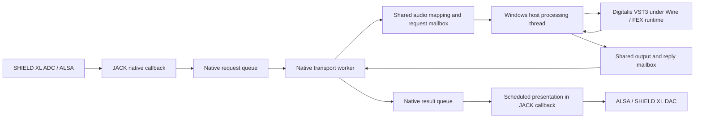

# Digitalis audio path and read-only Pi check

Observed 2026-09-24, 19:15–19:19 UTC. This is the operator-selected code-map
and Pi-inspection pass. No audio test, new playback, parameter/bypass change,
route change, restart, build, installation, or performance tuning was done.

The existing records do not explain the reported 275.79 ms analog round trip
as a steady bridge wait. They do show requests exceeding a 128-frame delivery
interval, and a separate confirmed five-minute Windows-host timeout hidden
behind still-running native/session services.

## Exact source and installed identity

The mapped native source is the existing timing-selector candidate based on
`a1af1c2634267381ca35cfbebd88634302158ecd`, tree
`1d08a05ef0ddbbe16e4c8df9c63f6eb0ed666fa3`, with its pre-existing uncommitted
128/256-frame admission changes. Those files were not modified or committed
by this inspection. Twelve relevant native source files match the retained
final build bundle byte-for-byte; the bundle digest is
`cf0b1da47d752fdf763d035855318dc22d7d286b80c938a113c931dcc1bb9fc1`.

The running native executable and installed candidate both hash to
`cb360cc0f29910e37f3faf98895a5b2c3b67283c4a4520757dcb064f63f4d02d`.
The installed Windows host hashes to
`4ab203ab8aa25555eebce6782cd52a11643a1b935abe8a2ce0cb04baeb453161`, matching
the onboarding receipt's host built from `6f9d292`. The three Windows files
mapped here are unchanged from that commit. This cross-check reuses retained
build provenance; it is not an independent reproducible-build qualification.

The sanitized [inspection receipt](../../evidence/rpi2/digitalis-audio-path-readonly.json)
contains file digests, actual ALSA settings, retained session counters,
timing rows, and the host-stop journal excerpts. No private audio, plug-in
state, vendor binary, account material, or machine address is included.

## Audio and ownership map

The configured launch chain is the private selector → native ARM executable
→ supervised launcher → UMU / steamrt4-arm64 / GE-Proton11-7-aarch64 → Windows
host → Windows x64 Digitalis. The launch chain and prefix are control-plane
ownership, not additional serial audio devices. No Linux DAW or VST3 proxy
binary is in the Pi's JACK graph: the standalone application reuses the
native proxy's Rust backend. MOTU and the laptop are outside this Pi graph.
The Windows cohort was already absent at inspection, so its live FEX module
and thread state were not reverified.

| Stage | Code owner | Timing / storage behavior |
| --- | --- | --- |
| Capture and playback callback | `rpi0/standalone/src/jack.rs`, `process` | Reads stereo JACK input, calls `Instance::process`, presents output and updates counters. Does not synchronously wait for Windows processing. |
| Native API crossing | `native-vst3-proxy/backend/src/rpi0.rs`, `Instance::process` | Calls `queued::if2_process` in the same native process. |
| Admission / presentation | `backend/src/queued.rs`, `process_events`, `Callback::process` | Splits at configured quantum, copies into requests, drains completions, presents samples at their original position plus the bridge reserve. |
| Request/result storage | `backend/src/queue.rs`; `queued.rs::DESCRIPTORS` | Separate preallocated 2,048-item queues and callback-side completed-audio storage. Capacity is not occupancy or a configured delay. At 128 frames, 2,048 audio items represent about 5.46 seconds of possible backlog. |
| Native transport | `backend/src/queued.rs`, `worker` | Processes requests sequentially. No discard of already-late audio requests before calling the Windows host was found in this path. Empty queue / control handoff uses a requested 50 microsecond sleep. |
| Audio preparation and validation | `backend/src/lib.rs`, `Session::process_events`; `native-audio-client/src/mapping.rs` | Copies input into the mapping, initializes output guards, serializes metadata, waits for one response, validates and copies returned samples. Includes allocations on the transport worker and full-capacity checks. |
| Cross-process notification | `backend/src/mailbox.rs`; `windows-factory-probe/source/delivery_mailbox.h` | One request in flight; audio itself is in a separate shared mapping. Native reply polling requests 50 microsecond sleeps; Windows request polling uses `NtDelayExecution` for 50 microseconds. Actual wakeup delay is not guaranteed by those constants. Issued-request failure deadline is five seconds. |
| Windows SDK processing | `windows-factory-probe/source/mapped_processing.cpp`; `offline_processing.cpp` | Copies to private plug-in buffers, prepares SDK objects, calls `processor.process`, checks buffers, copies output back and publishes completion. Owner/editor/control work has a separate thread/lane. |
| Returned audio | `queued.rs::Callback::process` | Missing scheduled output becomes counted silence. Late samples are expired/discarded; output is not intentionally retimed to play an ever-older FIFO. |
| Current-input bypass | `rpi0/standalone/src/audio.rs`, `present_output` | When explicitly enabled, substitutes current JACK input after bridge processing. The Windows processing workload continues. It can isolate presentation latency but is not a bridge-free CPU baseline. It was not changed in this inspection. |

`backend/` above abbreviates `native-vst3-proxy/backend/`. This map identifies
the implemented path; it is not a complete real-time allocation, reentrancy,
or architectural-conformance audit.

The 512-frame map capacity is storage capacity, not a requirement to accumulate
four 128-frame blocks. The native setup stores only the bridge reserve as its
presentation delay. The vendor's reported latency is added to the reported
total; this code does not add a second vendor-sized delay line.

## Read-back settings and measured processing time

The actual ALSA capture and playback endpoints both read back as stereo
S16_LE, 48 kHz, period size 128, buffer size 384 (three periods). JACK's
original command line still says 512 because the selector changes the live
period; the command line alone would give the wrong current answer.

Retained readiness and setup records agree on JACK 128, native reserve 128,
Windows processing quantum 128, map version 2/capacity 512, vendor latency
4,096, and reported total 4,224 frames. The physical JACK graph remains
system capture → Digitalis stereo inputs → Digitalis stereo outputs → system
playback. Current thermal observation was 47.4°C with `throttled=0x0`.

The session's existing observer retained these timings for 109,637 armed
requests. Values below are milliseconds; percentile values are histogram
upper bounds. These are processing/delivery timings, not analog latency.

| Stage | Mean | p99 upper bound | Maximum |
| --- | ---: | ---: | ---: |
| Native request queue wait | 0.057671 | 0.120 | 3.999655 |
| Windows `process()` interval | 0.341185 | 1.792 | 2.806400 |
| Admission through completed-output publication | 0.569233 | 2.048 | 4.356911 |
| Correlated non-plug-in residual | 0.228047 | 0.416 | 4.117711 |

The Windows interval includes execution through the translation runtime; it
does not isolate translation cost from vendor DSP. The residual includes
native queuing, copies, validation, waits, and host work outside the measured
vendor call. It is not a pure Wine/FEX overhead metric. Do not add the maxima
from different rows: they need not describe the same request.

At 128/48 kHz, one delivery interval is 2.666667 ms. Observed tail requests
exceeded that interval, consistent with the counted gaps. The frozen native
status before host loss reports 5,504 missing frames, 35 gaps, 5,376 expired
frames, and 128 priming frames. The older outer-log status shows only 3,456
missing frames / 19 gaps; its modification time is 18:47:54 UTC. Neither is a
continuously refreshed live readout after the host exit.

Observer accounting reports zero dropped jobs/samples; timing accumulation
starts after audio becomes armed, explaining why its request count must not
be called every lifetime request. Detailed phase tracing was not enabled and
the two known detailed-trace enable files were off. Basic observer work still
exists: full audio copies, sample statistics and timing aggregation continue.
This inspection therefore did not establish a diagnostics-disabled CPU baseline.

Digitalis's reported 85.333 ms algorithmic delay means output samples refer
to older input even when a call completes in 0.341 ms. The bridge's 2.667 ms
reserve is likewise distinct from processing time. The retained timings
provide no evidence of a steady additional 187.79 ms wait in this path.
They do not locate the missing analog-path time or disprove the operator's
275.79 ms measurement. A same-route baseline and correlated recording remain
necessary; the old 11.119 ms SHIELD XL loop used a different physical loop.

## Confirmed supervision failure

The private selector requests a 7,200-second session and gives its outer
owner 7,300 seconds. `rpi1/standalone/src/supervisor.rs::Cohort::launch` still
sets `RuntimeMaxSec=300` for the native runtime launcher hosting Windows.

At **18:49:04 UTC**, the exact Windows-host unit journal says it reached its
runtime limit and was stopped. At 18:49:06 it records a timeout result.
By inspection the unit was absent/inactive, with no Windows host process.
The native backend independently retained `delivery endpoint disconnected`
and terminal class 3 / native status 3 at frame position 14,057,856.

JACK, the native wrapper and outer owner remained active, with the old audio
ports connected. The outer selector waits for its wrapper child to exit;
wrapper liveness does not establish Windows-host or audio-delivery liveness.
The native command loop verifies the cohort when a status command is received,
but the observed automatic failure did not retire the outer session. This is
a concrete mismatch between supervision lifetimes and surfaced session state.
It does not establish the cause of the earlier latency measurement or earlier
transient gaps. No runtime limit was extended and no process was restarted.

## Next bounded decisions

1. Resolve the five-minute/two-hour supervision mismatch before another live
   session is treated as usable; this report does not implement that repair.
2. For dropouts, correlate specific slow requests with queue wait, Windows
   processing and non-plug-in residual. Sequential processing of already-late
   input, repeated copies/guard scans, polling, basic observer work, and the
   ordinary-priority native worker are concrete examination points, not
   proven removable costs. Arbitrarily dropping input may corrupt effect
   state/events and is not an accepted recovery policy.
3. For the unexplained analog delay, return to the same MOTU measurement route
   and distinguish native software pass-through, bridge pass-through and
   Digitalis. Cable loopback measures its own hardware route; it does not
   exercise the bridge's shared-memory/Windows processing path.

No code repair, CPU improvement, reduced latency, physical acceptance, or
current audible output is claimed by this documentation-only pass.
